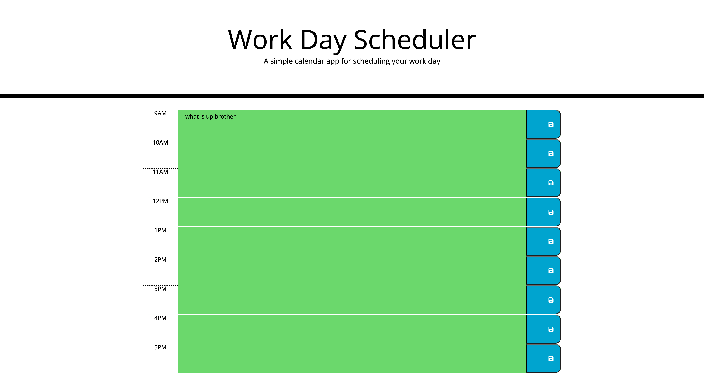

# day-planner

## About This Project

Having scheduling issues? Go ahead and record your "todos" here! 
In this web application, you will be able to write out your hourly list of things to do in each sub-hour time row and have the information remain intact even when you refresh the page (thanks to local storage)!

This calender will also show you which hours are in the past (red), currently happening (white/grey), or yet to come in the future (green)!

## How to Use

First, within each hour box, type in all the things you need to do for the day (9am -10am. 10am - 11am, etc).

Second, pay attention to the coloration of the boxes. Are you past due on things to do? Those will be red! Are you good to go on time? The grey boxes will say so! Are you ahead of schedule? Look for the green boxes! 

Third, try refreshing the page! Your information will remain in tact, so you can come back to the calender at any time and not have to worry about accidentally closing out the page. 

Last, get your things done :) 

## Difficulties

Thanks to my awesome tutor, I was able to figure out my for loop and .each function issues. Local storage was made easy, as she was so helpful in walking me through each step to ensure I was retaining information and not mindlessly coding. Since the page display was nearly a preset, only adding a few classes and id's was required to get the desired look. 

## Screenshot of Web Page

